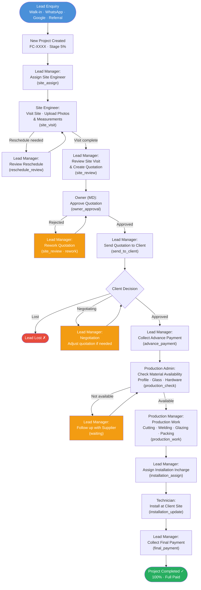

# Lead Flow PRD — Fenster App

## Overview

This document describes the end-to-end lifecycle of a lead in the Fenster app — from initial enquiry to project completion and final payment. Each stage maps to a specific role, a `FlowStage` task, and a `ProjectStage` progress value.

---

## Lead Sources

Leads enter through one of the following channels:

- Walk-in / Showroom
- WhatsApp / Phone Call
- Instagram / Facebook / Google
- Referral (Client ref, MD/ED ref, CNI, BNI)
- Existing Customer

---

## Stage-by-Stage Breakdown

| # | Project Stage | Progress | FlowStage | Role Owner | Action |
|---|---|---|---|---|---|
| 1 | New Project | 5% | — | Lead Manager | Lead created, project assigned a number (FC-XXXX) |
| 2 | Site Visit Assigned | 15% | `site_assign` | Lead Manager | LM assigns Site Engineer to visit |
| 3 | Site Visit | 20% | `site_visit` | Site Engineer | SE visits site, uploads photos & measurements |
| 4 | Quotation Preparation | 25% | `site_review` | Lead Manager | LM reviews site visit, creates quotation |
| 5 | Sent for Owner Approval | 30% | `owner_approval` | Owner (MD) | LM submits quotation; Owner approves or rejects |
| 6 | Owner Disapproved | 30% | `site_review` (rework) | Lead Manager | LM reworks quotation and resubmits |
| 7 | Owner Approved | 40% | `send_to_client` | Lead Manager | LM sends approved quotation to client |
| 8 | Sent to Client | 45% | `send_to_client` | Lead Manager | Client reviews quotation |
| 9 | Negotiation | 48% | — | Lead Manager | Client negotiates; LM adjusts if needed |
| 10 | Client Approved | 50% | `advance_payment` | Lead Manager | Client confirms; LM collects advance |
| 11 | Advance Payment | 55% | `advance_payment` | Lead Manager | Advance collected; releases to production |
| 12 | Production Check | 60% | `production_check` | Production Admin | PA checks material availability (Profile, Glass, Hardware) |
| 13 | Production Work | 65% | `production_work` | Production Manager | PM executes production checklist |
| 14 | Ready to Dispatch | 80% | `installation_assign` | Lead Manager | LM assigns Installation Incharge |
| 15 | Installation | 85% | `installation_update` | Technician | Technician installs at client site |
| 16 | Final Payment | 90% | `final_payment` | Lead Manager | LM collects balance payment |
| 17 | Completed | 100% | `completed` | Lead Manager | Project marked complete; paymentStatus = Full Paid |

---

## Flowchart

---

## Key Decision Points

### 1. Owner Quotation Approval
- **Approved** → LM sends to client
- **Rejected** → LM reworks and resubmits (loops back)

### 2. Client Decision
- **Approved** → advance payment, moves to production
- **Negotiating** → LM adjusts and resubmits
- **Lost** → lead is marked lost, project archived

### 3. Material Availability
- **Available** → production work begins immediately
- **Not Available** → LM follows up with supplier; loops back to availability check

---

## Role Responsibility Summary

| Role | Stages Owned |
|---|---|
| **Lead Manager** | Lead entry, Site assignment, Quotation creation, Client communication, Payments, Installation assignment |
| **Owner (MD)** | Quotation approval only |
| **Site Engineer** | Site visit, measurements, photos |
| **Production Admin** | Material availability check |
| **Production Manager** | Production work (cutting, welding, glazing, packing) |
| **Technician** | On-site installation |

---

## Exit Conditions

| Outcome | Trigger |
|---|---|
| **Won** | Final payment collected → `completed` |
| **Lost** | Client rejects quotation and does not proceed |
| **On Hold** | Project paused at any stage |
